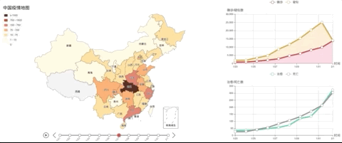

# 武汉新型冠状病毒防疫信息收集平台-地图可视化项目

本项目负责平台的信息展示，可视化地理信息。

## 项目介绍

提供基于 ECharts 可视化库的前端组件。

### 创建一个完整独立的疫情地图

- **目的&设计**：创建一个独立的疫情地图可视化，有两个主要目标
  1. 地理精度：有市级地理粒度，最开始是一个全国地图的 heatmap，点击一个省重绘成省 map。（[重绘参考](https://gallery.echartsjs.com/editor.html?c=xm3iS_cb0g)）
  - optional: 可能会做成县级精度，具体见[讨论](https://github.com/wuhan2020/map-viz/issues/52)
  2. 时间信息：有时间轴，点击一个地区可以画出[stacked area chart](https://echarts.apache.org/examples/en/editor.html?c=area-stack)之类的疫情发展图 (确诊/疑似/死亡为不同层)，也可以根据选择的时间点重绘地图。([时间轴参考案例](https://echarts.apache.org/examples/en/editor.html?c=mix-timeline-finance))
- **使用**：取决于数据
  - 如果自动抓取省市级数据：疫情地图与前端其他组件交互较少，且数据可以[通过 API 直接获取](http://lab.isaaclin.cn/nCoV/api/area?latest=0)，可以作为单独 webpage，最终作为 iframe 整合进前端页面。
  - 如果使用手动抓取的县级数据，则作为组件融入前端，接受传入数据。[讨论](https://github.com/wuhan2020/map-viz/issues/52)
- **进度**



- [x] 基础疫情地图，并用统计图（线图+ stacked area chart）显示疫情发展数据
- [x] 省市层级交互
- [x] 时间轴交互
- [ ] 接入手动收集的省级数据
- [ ] 疫情地图时间轴与统计图联动

### 创建一个通用地图组件

- **目的**：用于可视化各种不同地理信息（例如医院位置，酒店位置，etc.）
- **使用**：作为组件被前端调用，数据来自前端。
- **基础设计**：点图+地图（[参考例子](https://www.echartsjs.com/examples/zh/editor.html?c=effectScatter-bmap)）
- **交互**：
  - 不自带过滤等交互组件，上层应该自己创建 checkbox, slider, etc. 过滤后数据传入地图组件可以重绘地图
  - 接受传入的 mouseEvent，可以帮助做信息过滤及定位（e.g., 点击一个省选中它的信息）
  - ([相关讨论](https://github.com/wuhan2020/map-viz/issues/2#issuecomment-578626578))
- [数据格式设计讨论](https://github.com/wuhan2020/map-viz/issues/3)
- **进度**


## 使用

详情参考/src/pages/hierarchicalVirusMapDemo.tsx以及/src/pages/informationMapDemo.tsx

## 本地开发

### 配置

1. [安装 Node.js](https://nodejs.org/en/download/package-manager/)
2.

```sh
# clone the repo
git clone git@github.com:wuhan2020/map-viz.git
# setup the npm env
cd map-viz
npm install
# start the project
npm start
```

### 任务拆分&参与指南

[合作指南参考主 repo](https://github.com/wuhan2020/wuhan2020/blob/master/CONTRIBUTING.md)（viz 没有项目机器人+注意将 demo script 改成我们的 repo）
TL;DR:

1. 请在[project 面板](https://github.com/wuhan2020/map-viz/projects/1)自行认领&self-assign issues（如果不能更改 assignee，请回复 issue 表示认领，我们会后面添加 assign）
2. 对数据和设计如果有讨论请参见如下 issue:

- [地图设计讨论](https://github.com/wuhan2020/map-viz/issues/2)
- [数据格式设计讨论](https://github.com/wuhan2020/map-viz/issues/3)
- [收集已有数据及可视化](https://github.com/wuhan2020/map-viz/issues/7)

3. 如有其它建议请开 issue
4. 参与更多讨论请加入[slack 讨论组](https://join.slack.com/t/wuhan2020/shared_invite/enQtOTI2NTU1NzU3MTM2LWQ1YjIzMDllYjYzYTE1OTNhMWU4OTZkOGYzOGJhOWM2MzdlMjgwMmZiOWEzYTQwNmJkZDI4OWRmM2Q2ZDM1MTc)，我们在 channel #proj-map-visualization

## 技术栈

- 可视化库: [ECharts v4][4]
- 逻辑语言: [TypeScript v3][1]
- 开发框架: [React.js][2]
- 组件库: [Ant Design][3]

## 教程及有用链接

[5 分钟上手 ECharts](https://www.echartsjs.com/zh/tutorial.html#5%20%E5%88%86%E9%92%9F%E4%B8%8A%E6%89%8B%20ECharts)

[echarts example](https://gallery.echartsjs.com/explore.html#sort=rank~timeframe=all~author=all)

[百度地图](http://lbsyun.baidu.com/jsdemo.htm#canvaslayer)

[坐标拾取](http://api.map.baidu.com/lbsapi/getpoint/index.html)

### 例子

[百度迁徙](https://qianxi.baidu.com/?from=shoubai#city=420100)

[百度实时疫情数据](https://voice.baidu.com/act/newpneumonia/newpneumonia)

[丁香园实时疫情数据](https://3g.dxy.cn/newh5/view/pneumonia)

[qq 实时疫情数据](https://news.qq.com/zt2020/page/feiyan.htm)

### 临时接口

[省市每日历史数据](http://ncov.nosensor.com:8080/api/)

[百度实时疫情](https://service-nxxl1y2s-1252957949.gz.apigw.tencentcs.com/release/newpneumonia)

[百度迁徙](https://huiyan.baidu.com/migration/cityrank.jsonp?dt=city&id=420100&type=move_out&date=20200128&callback=jsonp_1580257678289_5758459)

[丁香园实时疫情](https://service-0gg71fu4-1252957949.gz.apigw.tencentcs.com/release/dingxiangyuan)

[丁香园每分钟历史数据](http://lab.isaaclin.cn/nCoV/api/area?latest=0)

[丁香园其他](http://lab.isaaclin.cn/nCoV/)

[qq 实时+历史疫情](https://service-n9zsbooc-1252957949.gz.apigw.tencentcs.com/release/qq)

[百度地图地址转经纬度](https://service-qf7o2c4u-1252957949.gz.apigw.tencentcs.com/release/bmap?address=华中科技大学)

[新闻收集接口](http://ncov.news.dragon-yuan.me/api/news?search=&page=)

[1]: https://typescriptlang.org
[2]: https://react.docschina.org
[3]: https://ant.design
[4]: https://www.echartsjs.com/